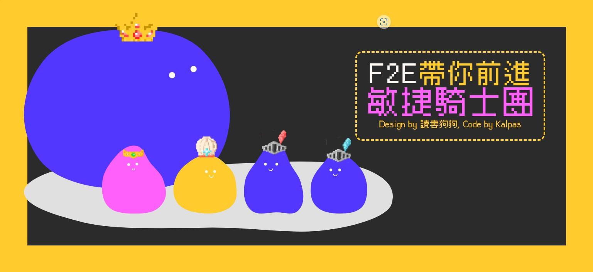

# 4th F2E 第三關 Scrum 新手村

---

# Demo

[Demo](https://f2e-scrum-training.vercel.app/)

# Features

- Scrum 教學遊戲
- 透過拖放、勾選答案的方式增加互動
- 有轉場與動畫效果
- 文字有 Type Writer 特效

# 使用技術

- React
- React Context API
- React Router
- Tailwind CSS
- react-beautiful-dnd
- Framer motion
- typewriter-effect

# 設計稿

[source](https://2022.thef2e.com/users/12061549261446746191/)
by 讀書狗狗
